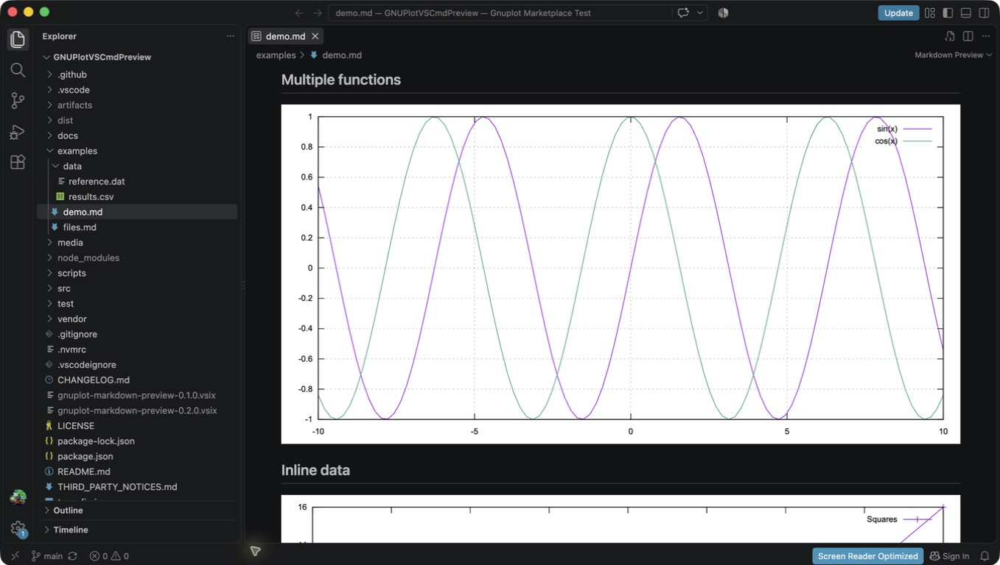
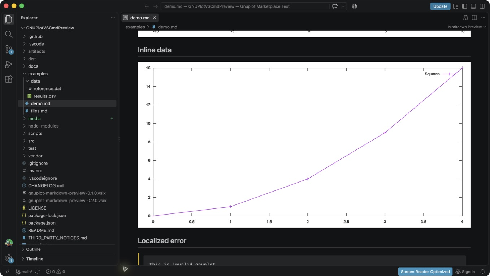
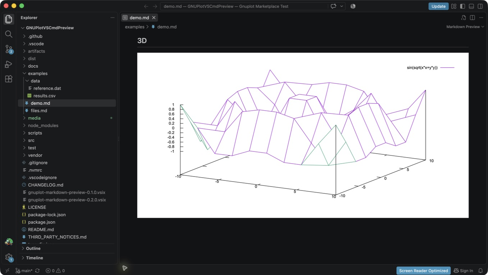

# Gnuplot Markdown Preview

Render `gnuplot` code fences directly in VS Code's built-in Markdown Preview, locally with bundled WebAssembly. No system gnuplot installation is required.

## Example

````markdown
```gnuplot
set grid
set xrange [-10:10]

plot sin(x) title "sin(x)", \
     cos(x) title "cos(x)"
```
````

Open the normal Markdown Preview to see an inline SVG plot in place of the fence.



## Features

- Real gnuplot syntax, using gnuplot 6.0.2 compiled to WebAssembly.
- Local rendering with no network service or native gnuplot process.
- Crisp SVG output and responsive plot sizing.
- Inline datasets, relative CSV/data files, multiple functions, and 3D plots.
- File-backed plots refresh when their saved data changes.
- Normal Markdown and other fenced languages remain unchanged.
- Localized errors and an in-memory plot cache.

## Usage

1. Install **Gnuplot Markdown Preview** (`ReoX86.gnuplot-markdown-preview`).
2. Open a Markdown file.
3. Add a fenced block with the language `gnuplot` (optionally followed by the attributes below).
4. Run **Markdown: Open Preview** from the Command Palette, or press **Ctrl+Shift+V** on Windows/Linux and **Cmd+Shift+V** on macOS. Use **Markdown: Open Preview to the Side** for an editor-and-preview layout.

## Alt text and captions (0.2.3)

Add an accessible description and a visible caption after the language name:

````markdown
```gnuplot {alt="Sine and cosine curves" caption="Figure 1: Trigonometric functions"}
set grid
plot sin(x), cos(x)
```
````

Both attributes are optional and may appear in either order. Use single or double quotes; escape a matching quote or a backslash with a backslash. Values are plain text, not Markdown or HTML. `alt` labels the plot for assistive technology; `caption` appears beneath it. Unknown attributes, duplicate keys, and malformed syntax show a local fence error. Bare `gnuplot` fences continue to work unchanged.

## Examples

### Multiple functions

```gnuplot
set xrange [-10:10]
set grid
plot sin(x), cos(x), atan(x)
```

### Inline data

```gnuplot
$data << EOD
0 0
1 1
2 4
3 9
4 16
EOD
plot $data using 1:2 with linespoints title "Squares"
```



### 3D surface

```gnuplot
set hidden3d
splot sin(sqrt(x*x+y*y))
```



See [examples/demo.md](https://github.com/Reonarudo/gnuplot-markdown-preview/blob/main/examples/demo.md) for a complete preview fixture.

## Relative data files (0.2.0)

In a **trusted local workspace**, paths resolve relative to the saved Markdown document:

```gnuplot
set datafile separator comma
plot "./data/results.csv" using 1:2 with linespoints title "Results"
```

Gnuplot reads the original data bytes: use its normal separator, header, and `using` options. `.csv`, `.dat`, and `.txt` files are supported as literal operands in `plot` and `splot`, including subdirectories, multiple files, and empty-filename reuse (`""`). Save your data file to refresh affected plots; unsaved data edits are not used. **Gnuplot: Refresh Data** reloads saved inputs explicitly.

Files must stay inside the Markdown document's own workspace folder. Parent-relative paths such as `../data/results.csv` work within that boundary. Absolute paths, symlink components, URLs, computed filenames, and script loading are unsupported. Unsaved documents, documents outside a workspace, remote URI providers, and Restricted Mode support self-contained plots only.

Limits: 1 MiB per file, 4 MiB and 16 files per plot, 32 MiB of cached file snapshots, 128 file-backed plots, and eight concurrent loading requests. Close unused Markdown documents and run **Gnuplot: Refresh Data** if the cache budget is reached. A loading message appears until files are ready; read errors stay local to their plot. See [examples/files.md](https://github.com/Reonarudo/gnuplot-markdown-preview/blob/main/examples/files.md).

## Output and errors

The preview selects the SVG terminal and output file for you. Omit `set terminal` and `set output`: direct terminal/output changes are rejected with a local error. Programs should produce one plot, or a single `set multiplot` composition. Scripts that fail, select incompatible output indirectly, or produce no complete SVG show an error block without breaking the rest of the preview.

Every program starts with clean gnuplot memory. Variables and datablocks do not carry between fences. Plots use a white background in both light and dark editor themes.

## Limitations in 0.2.0

- External data supports literal filenames in `plot`/`splot`; computed filenames, iteration-generated filenames, binary data, `load`/`call` scripts, and shell pipelines are unsupported.
- SVG is the only supported output. Other terminal types and interactive terminal features are unavailable.
- The bundled build excludes native GUI, bitmap, Lua, plugin, and optional external-library features.
- Maximum source: 64,000 characters; maximum SVG: 4 MB; WASM memory: 64 MiB; render time: three seconds.
- After a render timeout the worker stops. Run **Developer: Reload Window** to resume plotting.
- Desktop VS Code and remote extension hosts are supported; browser-only VS Code is not.
- A document with many distinct expensive plots can take time to render. The 96-entry cache avoids repeating identical work.

## Security

Gnuplot executes inside the bundled WebAssembly environment, never by invoking a system gnuplot process. The runtime is built without Node shell/filesystem bridges and only sees restricted in-memory files. Gnuplot cannot read the host filesystem or invoke its shell. In a trusted local workspace, the extension reads validated data files and supplies read-only in-memory snapshots. Restricted Mode does not read external data. Paths are checked before and after loading, but this is not an OS sandbox against another process concurrently replacing workspace directories; only trust workspaces you control. SVG is sanitized before inclusion: scripts, event handlers, executable HTML, and external resources are excluded. No telemetry is collected.

See [the audit](https://github.com/Reonarudo/gnuplot-markdown-preview/blob/main/docs/licensing-audit.md) for the build provenance and security boundaries.

## Development

Use Node 24 LTS and npm:

```sh
npm ci
npm run lint
npm run build
npm test
npm run test:extension
npm run package
npm run test:package
```

Extension-host and package tests download official VS Code and require a desktop display (use `xvfb-run -a` on Linux). Set `VSCODE_VERSION=1.95.0` to test the minimum version, or `VSCODE_EXECUTABLE` to use an existing application executable.

Press F5 to launch the Extension Development Host and open `examples/demo.md`. The normal build copies audited WASM assets from `vendor/gnuplot`. Rebuilding WASM itself requires Emscripten 6.0.9 and `bash scripts/build-wasm.sh`; compiler prerequisites are unnecessary for normal extension development.

GitHub Actions checks the build and packaged rendering path. Tags create a GitHub Release containing the tested VSIX. Marketplace publishing is an explicit authenticated step; see [publishing.md](https://github.com/Reonarudo/gnuplot-markdown-preview/blob/main/docs/publishing.md).

## Roadmap

1. Verified remote/provider-backed data files.
2. Theme-aware plots.
3. Fence rendering options for dimensions and appearance.

## License

The extension's original code and artwork are [MIT licensed](https://github.com/Reonarudo/gnuplot-markdown-preview/blob/main/LICENSE). Bundled gnuplot uses its own license. Compiler runtime and XML parser notices are retained in [THIRD_PARTY_NOTICES.md](https://github.com/Reonarudo/gnuplot-markdown-preview/blob/main/THIRD_PARTY_NOTICES.md) and the accompanying notice files.
